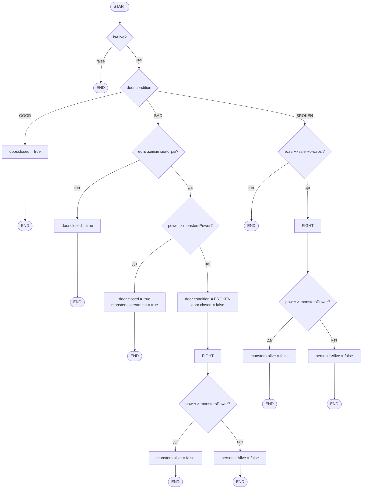

Артур уперся плечом в дверь кабины, стараясь запереть ее, но она была плохо подогнана. Маленькие мохнатые ручки 
просовывались во все щели, пальцы на них были перепачканы чернилами; безумно верещали какие-то тоненькие голоса.

Сформируем доменную модель для заданного текста:

Сущности и их атрибуты:
1) Персонаж 
    характеристики: power
    состояния: isAlive
2) Дверь 
    состояния: condition
3) Монстры 
    характеристики: power
    состояния: isAlive, isScreaming

Тестовые сценарии:
1) Мертвый персонаж — isAlive=false → состояние двери и монстров не меняется.
2) Дверь GOOD, монстров нет → дверь закрыта (closed=true), состояние двери не меняется (GOOD).
3) Дверь GOOD, есть живые монстры → дверь закрыта (closed=true), монстры остаются живыми.
4) Дверь BAD, монстров нет → дверь закрыта (closed=true), состояние двери BAD не меняется.
5) Дверь BAD, есть живые монстры, сила персонажа больше силы монстров → дверь закрыта, все монстры начинают кричать (screaming=true), монстры остаются живыми.
6) Дверь BAD, есть живые монстры, сила персонажа меньше или равна силе монстров → дверь становится BROKEN, дверь открыта (closed=false), персонаж погибает (isAlive=false).
7) Дверь BROKEN, есть живые монстры, сила персонажа больше силы монстров → все монстры погибают (alive=false), персонаж жив.
8) Дверь BROKEN, есть живые монстры, сила персонажа меньше или равна силе монстров → персонаж погибает (isAlive=false), монстры остаются живыми.
9) Дверь BAD, все монстры мертвые → дверь закрыта (closed=true), состояние двери не меняется (BAD), бой не начинается.
